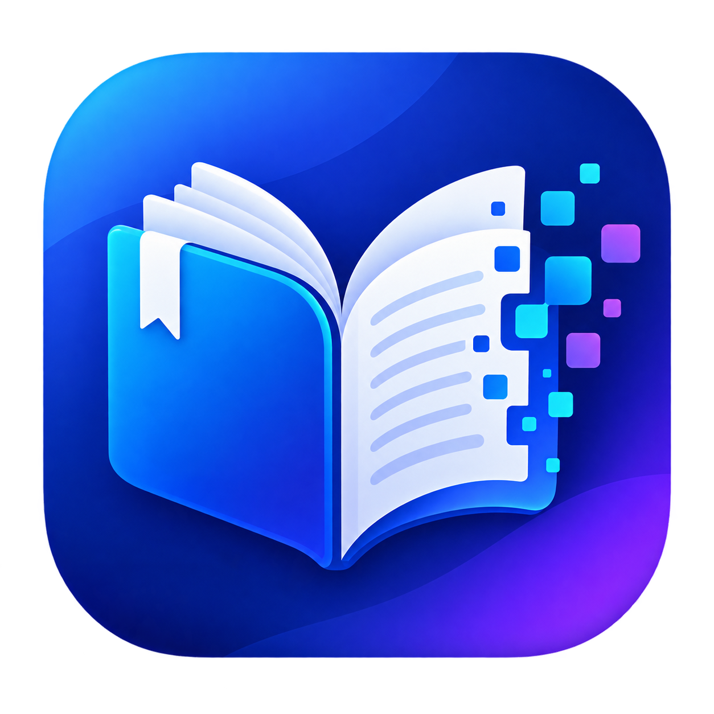
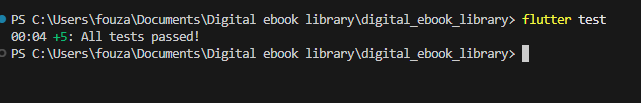

# Digital E Book (Digital E-Book Library Application)



**Digital E Book** is a state-of-the-art, feature-rich Flutter e-book library and PDF reader application built following strict **Clean Architecture**, **MVVM design principles**, and **BLoC state management**. Inspired by classic e-book bookshelf aesthetics, it offers an intuitive reading experience with debounced live search, format filtering, file upload persistence, public user-accessible file downloads, and a full-screen Sun & Moon theme transition animation.

---

## Table of Contents
- [Project Overview](#project-overview)
- [Tech Stack](#tech-stack)
- [Key Features](#key-features)
- [Setup Instructions](#setup-instructions)
- [How to Run Backend](#how-to-run-backend)
- [How to Run Flutter App](#how-to-run-flutter-app)
- [Flutter Tests & Test Results](#flutter-tests--test-results)
- [API Overview](#api-overview)
- [Known Limitations](#known-limitations)
- [AI Tools Used](#ai-tools-used)

---

## Project Overview
The Digital E Book library application provides a digital bookstore experience for discovering, downloading, reading, and managing e-books. The app supports multiple view modes (Classic Apple Bookshelf UI, Grid layout, and List view), dynamic Light ("White Mode") vs. Dark Void themes with spring-animated overlays, and persistent reading progress tracking.

### Architectural Layering (Clean Architecture + MVVM)
- **Domain Layer**: Contains business entities (`EbookEntity`), abstract repository contracts (`EbookRepository`), and decoupled use cases (`FetchEbooksUseCase`, `DownloadEbookUseCase`, `UploadEbookUseCase`, `DeleteEbookUseCase`).
- **Data Layer**: Implements repository interfaces (`EbookRepositoryImpl`), remote data sources (`EbookRemoteDataSource`), local data sources (`EbookLocalDataSource`), data models (`EbookModel`), and persistent storage (`SharedPreferences` & `path_provider`).
- **Presentation Layer**: Built with **BLoC** (`EbookBloc`, `DownloadBloc`, `ReaderBloc`, `ThemeBloc`), responsive widgets (`BookshelfViewWidget`, `FeaturedCarouselWidget`, `RecentlyReadWidget`), and dynamic themes (`AppColors`, `ThemeTransitionOverlay`).

---

## Tech Stack
- **Framework**: Flutter 3.x (Dart 3.x)
- **State Management**: `flutter_bloc` (v8.1.x) & `equatable`
- **Dependency Injection**: `get_it` (Service Locator pattern)
- **Networking & Downloads**: `dio` (v5.4.x)
- **PDF Viewer**: `syncfusion_flutter_pdfviewer` (v34.2.x)
- **Persistence & Storage**: `shared_preferences` & `path_provider`
- **File System & Sharing**: `open_filex`, `share_plus`, `file_picker`
- **Mock REST API Backend**: Node.js, Express, Docker, Docker Compose

---

## Key Features
1. **Classic Bookshelf UI & View Modes**:
   - Classic Apple Bookshelf UI with wooden ledges and realistic book cover spines.
   - Toggle seamlessly between Bookshelf, Grid, and List library view modes.
2. **Dynamic Light & Dark Themes with Animated Pop Transition**:
   - Full-screen **Sun & Moon Pop Animation**: Spring-animated golden Sun with rotating rays (Light Mode) and Crescent Moon with twinkling stars (Dark Mode).
   - Theme persistence across app restarts via `SharedPreferences`.
3. **User-Accessible Public E-Book Storage**:
   - Saves completed downloads directly to Android's public `Downloads` directory (`/storage/emulated/0/Download`), visible in device File Manager apps.
   - Provides native **"Open File"** and **"Share File"** actions.
4. **Real-time Dio Percentage Progress**:
   - Streams download byte progress with real-time percentage indicators (`0%` to `100%`).
   - Prevents duplicate download triggers while a download is running.
5. **Debounced Search & Multi-Format Filtering**:
   - Live debounced search across titles, authors, and categories.
   - Filter by format (`PDF`, `EPUB`, `MOBI`, `TXT`) and sort by Title, Author, or Upload Date.
6. **In-App PDF Reader & Progress Tracking**:
   - Built-in PDF reader with bookmarking, page navigation, and automatic reading progress persistence.

---

## Setup Instructions

### Prerequisites
- [Flutter SDK](https://docs.flutter.dev/get-started/install) (version 3.12+ recommended)
- [Dart SDK](https://dart.dev/get-started/sdk) (version 3.x)
- Android Studio / Xcode / VS Code
- Docker Desktop (optional, for running local mock backend server)

### Clone & Install
```bash
# Clone the repository
git clone https://github.com/fouzzann/Digital-Ebook-Library.git

# Navigate into project directory
cd digital_ebook_library

# Install Flutter dependencies
flutter pub get
```

---

## How to Run Backend

The project includes a lightweight Express.js REST API server located in the `/backend` directory.

### Option A: Using Docker Compose (Recommended)
```bash
cd backend
docker-compose up --build -d
```

### Option B: Running via Node.js
```bash
cd backend
npm install
npm start
```
The mock backend server listens on `http://localhost:3000` (or `http://10.0.2.2:3000` for Android Emulator).

---

## How to Run Flutter App

Ensure an emulator or physical device is connected, then run:

```bash
# Run on default connected device
flutter run

# Run on specific target (e.g. Chrome / Android Emulator)
flutter run -d android
flutter run -d chrome
```

---

## Flutter Tests & Test Results

Run the complete automated unit and widget test suite for the project:

```bash
flutter test
```

### Test Results

All tests execute cleanly and pass successfully:



```text
00:04 +5: All tests passed!
```

### Test Coverage Highlights
- `test/download_storage_test.dart`: Validates `DownloadBloc` percentage progress, public storage path resolution, and duplicate download prevention.
- `test/pdf_reader_page_test.dart`: Tests PDF reader initialization and reading progress persistence.
- `test/upload_ebook_page_test.dart`: Validates custom e-book upload forms and file selection.
- `test/ebook_card_test.dart`: Tests `EbookCard` rendering (title, author, format badge, rating) and tap/download/delete callbacks.
- `test/empty_state_test.dart`: Validates `EmptyView` title, subtext, icon, and reset filter action button.
- `test/search_ui_test.dart`: Verifies `SearchBarWidget` debounced search typing and clear button behavior.
- `test/delete_confirmation_test.dart`: Tests confirmation `AlertDialog` rendering and `DeleteEbook` BLoC event dispatching.
- `test/ebook_bloc_test.dart`: Unit tests for `EbookBloc` state transitions (`LoadEbooks`, `SearchEbooks`, `DeleteEbook`).
- `test/validation_logic_test.dart`: Unit tests for form field validation rules and `EbookEntity` immutability.
- `test/widget_test.dart`: Verifies core application rendering and service locator registration.

---

## API Overview

The mock REST API backend exposes the following endpoints:

| Method | Endpoint | Description |
| :--- | :--- | :--- |
| `GET` | `/api/ebooks` | Fetch catalog with optional `category`, `format`, and `query` params |
| `GET` | `/api/ebooks/:id` | Retrieve detailed metadata for a specific e-book |
| `POST` | `/api/ebooks` | Upload a new e-book entity |
| `GET` | `/api/ebooks/:id/download` | Stream binary payload with percentage progress tracking |
| `DELETE` | `/api/ebooks/:id` | Remove an e-book entry from the library index |

---

## Known Limitations
- **Native Platform Channels**: Adding native plugins (`open_filex`, `share_plus`) requires a full app build (`flutter run`) rather than a simple hot reload. A try-catch fallback automatically opens files in the built-in `PdfReaderPage` if native app handlers are unregistered.
- **Web Storage**: Web platforms store file downloads in memory buffers rather than direct filesystem paths.

---

## AI Tools Used

### AI Pair Programming Assistant
Developed in collaboration with **Google DeepMind's Antigravity Agentic AI Assistant**.

### How AI Tools Were Utilized
1. **Clean Architecture Design**: Structuring decoupled Domain, Data, and Presentation layers with SOLID principles.
2. **BLoC State Machine Implementation**: Engineering event-driven state transitions (`EbookBloc`, `DownloadBloc`, `ReaderBloc`, `ThemeBloc`).
3. **Modern Design System & Animations**: Crafting glassmorphism tokens, the classic iOS Apple Bookshelf UI, and custom 60fps spring-animated Sun/Moon full-screen theme transition overlays.
4. **Storage & Public File Access**: Implementing public Android Download folder resolution (`/storage/emulated/0/Download`), Dio file streaming, and robust fallback opening logic.
5. **Testing & QA**: Formulating comprehensive unit test suites and widget tests for key application flows.